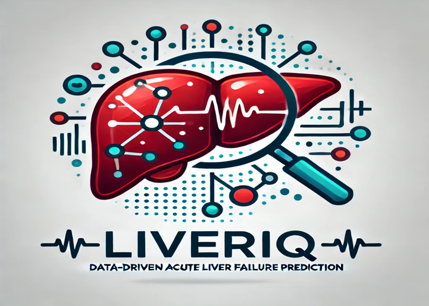

# LIVERIQ-Data-Driven-Acute-Liver-Failure-Prediction

  

Conducted extensive data preprocessing and EDA to uncover clinical patterns, then applied multiple ML models to predict acute liver failure with 95% accuracy. Improved model performance via feature engineering and cross-validation, supporting early disease detection through data-driven insights.
